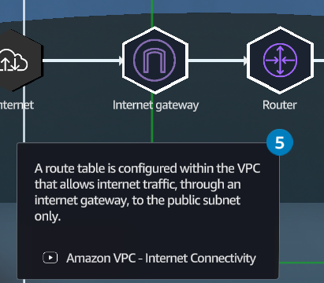
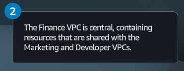
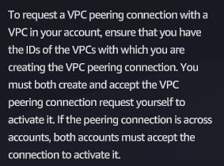
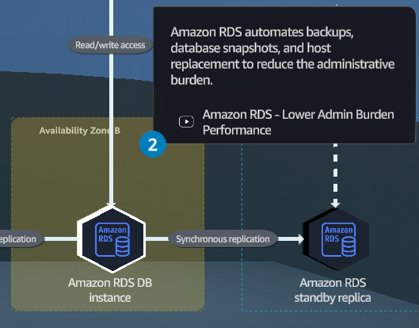
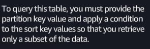
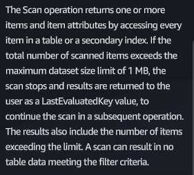
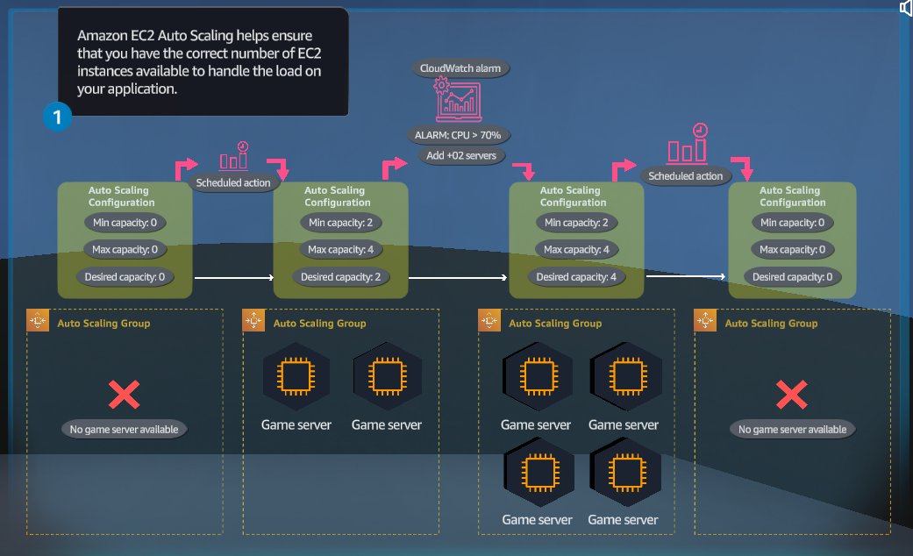
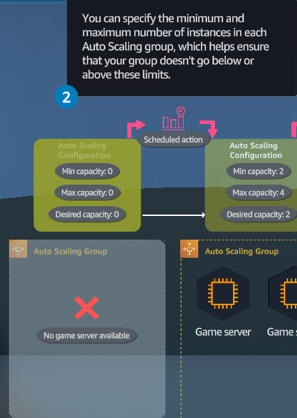

# AWS Cloud Quest Notes

## Policies:

Sample:

```json
{
    "Version": "2012-10-17",
    "Id": "StaticWebPolicy",
    "Statement": [
        {
            "Sid": "S3GetObjectAllow",
            "Effect": "Allow",
            "Principal": "*",
            "Action": "s3:GetObject",
            "Resource": "arn:aws:s3:::website-bucket-c45b48f0/*"
        }
    ]
}
```


- `Effect` says this policy will Allow access.
- `Principal` defines who has access. In this case, * represents anyone.
- `Action` defines what users can do to objects in the bucket. In this case, users can only retrieve data with `GetObject`.
- `Resource` specifies that this policy applies to only this bucket.
- Generally, to safeguard against unintentional data exposure, we recommend strict S3 bucket permissions in production. 

you can grant permissions to S3 resources via bucket policies and user policies

an Amazon Resource Name (ARN) identifies aws resources

## Launching an EC2 instance


## Connecting to an EC2 instance; Vertically scaling an EC2 instance


1. To provide root privileges to the current session, in the terminal window, at the command prompt, run the following command (type the command and press Enter):

`sudo -i`

2. To change to the application directory, run: 

`cd ../home/ec2-user/sample_app`

- Be sure to add a space between cd and the ../ command.
- A sample application resides on this instance. 


3. To view the files in the sample_app directory, run: 

`ls`
			 
4. To check the instance log, run: 

`tail -lf aws_compute_solutions.log`
			
5. Go to the next step.


## Networking concepts

- Configure a routing table and attach an internet gateway
- Configure a security group





## Coonecting VPCs





(If a EC2 instance has no public IP address, this is because it was created in a private subnet.)


from the EC2 cli, enter `ping <ip>` to check private connection between current and other vpc


You can identify internet gateways by id `igw-xxx...`





 
(they remember who came in, and who came out)


## Databases in practice


...





## NoSQL Databases







## File systems in the cloud


(Remember:)


## Auto-Healing and Scaling Applications






