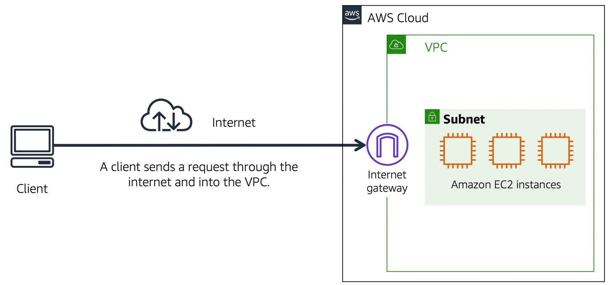
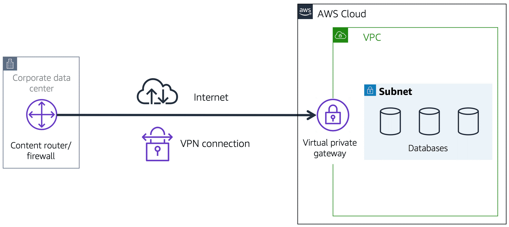
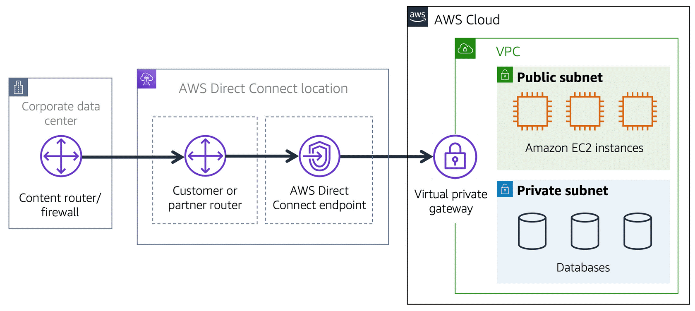

# AWS Overview

<!-- TOC start (generated with https://github.com/derlin/bitdowntoc) -->

- [AWS Overview](#aws-overview)
   * [Module 1: Introduction to AWS Services](#module-1-introduction-to-aws-services)
      + [1.1 What is AWS](#11-what-is-aws)
      + [1.2 The client-server model](#12-the-client-server-model)
      + [1.3 Cloud computing](#13-cloud-computing)
      + [1.4 Deployment models for cloud computing](#14-deployment-models-for-cloud-computing)
         - [Cloud-based** ](#cloud-based)
         - [**On-premises**](#on-premises)
         - [**Hybrid**](#hybrid)
      + [1.5 Benefits of cloud computing](#15-benefits-of-cloud-computing)
         - [No upfront payments:](#no-upfront-payments)
         - [No maintenance costs: ](#no-maintenance-costs)
         - [No capacity predictions](#no-capacity-predictions)
         - [Open to economies of sale: ](#open-to-economies-of-sale)
         - [More speed and agility](#more-speed-and-agility)
         - [Fast deployment](#fast-deployment)
   * [Module 2: Cloud computing](#module-2-cloud-computing)
      + [2.1 Elastic Compute Cloud (EC2)](#21-elastic-compute-cloud-ec2)
         - [Traditional on-premises resources vs. cloud EC2 instances (and similar)](#traditional-on-premises-resources-vs-cloud-ec2-instances-and-similar)
            * [Traditional](#traditional)
            * [EC2](#ec2)
         - [Basic Use:](#basic-use)
      + [2.2 EC2 Instance Types](#22-ec2-instance-types)
         - [General purpose instances](#general-purpose-instances)
         - [Compute optimized instances](#compute-optimized-instances)
         - [Memory optimized instances](#memory-optimized-instances)
         - [Accelerated computing instances](#accelerated-computing-instances)
         - [Storage optimized instances](#storage-optimized-instances)
      + [2.3 Billing options for EC2](#23-billing-options-for-ec2)
         - [On-Demand](#on-demand)
         - [Reserved Instances](#reserved-instances)
            * [Standard Reserved Instances: ](#standard-reserved-instances)
         - [Convertible Reserved Instances: ](#convertible-reserved-instances)
         - [EC2 Instance Savings Plans](#ec2-instance-savings-plans)
         - [Spot Instances](#spot-instances)
         - [Dedicated Hosts](#dedicated-hosts)
      + [2.4 EC2 Auto Scaling](#24-ec2-auto-scaling)
         - [Configuration](#configuration)
      + [2.5 Elastic Load Balancing (ELB)](#25-elastic-load-balancing-elb)
      + [2.6 Monolithic vs. Microservices Architectures](#26-monolithic-vs-microservices-architectures)
      + [2.7 Simple Notification Service (SNS) and Simple Queue Service (SQS)](#27-simple-notification-service-sns-and-simple-queue-service-sqs)
         - [SQS](#sqs)
         - [SNS](#sns)
      + [2.8 Additional AWS compute options](#28-additional-aws-compute-options)
         - [AWS Lambda](#aws-lambda)
            * [Basic use:](#basic-use-1)
         - [Elastic Container Service (ECS)](#elastic-container-service-ecs)
         - [Elastic Kubernetes Service (EKS)](#elastic-kubernetes-service-eks)
         - [Fargate](#fargate)
   * [Module 3: Global Infrastructure and Reliability](#module-3-global-infrastructure-and-reliability)
      + [3.1 AWS Global Infrastructure](#31-aws-global-infrastructure)
         - [Regions](#regions)
            * [How to choose a Region](#how-to-choose-a-region)
      + [3.2 Availability Zones](#32-availability-zones)
      + [3.3 CloudFront and edge locations](#33-cloudfront-and-edge-locations)
      + [3.4 Methods for provisioning AWS services](#34-methods-for-provisioning-aws-services)
         - [Management Console (browser-based UI)](#management-console-browser-based-ui)
         - [AWS Command Line Interface](#aws-command-line-interface)
         - [Software Development Kits](#software-development-kits)
      + [3.5 Other managed AWS tools](#35-other-managed-aws-tools)
         - [Elastic Beanstalk](#elastic-beanstalk)
         - [CloudFormation](#cloudformation)
   * [Module 4: Networking](#module-4-networking)
      + [4.1 AWS Connectivity and Networking](#41-aws-connectivity-and-networking)
         - [Public vs. private](#public-vs-private)
      + [4.2 Virtual Private Cloud (VPC)](#42-virtual-private-cloud-vpc)
      + [4.3 Internet Gateway and Virtual Private Gateway (VPG)](#43-internet-gateway-and-virtual-private-gateway-vpg)
         - [Internet Gateway](#internet-gateway)
         - [Virtual Private Gateway (VPG)](#virtual-private-gateway-vpg)
      + [4.4 Direct Connect](#44-direct-connect)
      + [4.5 Subnets and Network Access Control Lists (ACLs)](#45-subnets-and-network-access-control-lists-acls)
      + [4.6 Access Control Lists and Security Groups](#46-access-control-lists-and-security-groups)
         - [Access Control Lists (ACLs)](#access-control-lists-acls)
         - [Security Groups](#security-groups)
      + [4.8 Global Networking: Domain Name System (DNS) and Route 53](#48-global-networking-domain-name-system-dns-and-route-53)
         - [Domain Name System](#domain-name-system)
         - [Route 53](#route-53)

<!-- TOC end -->

<!-- TOC -->

## Module 1: Introduction to AWS Services

1. What is AWS
2. The client-server model
3. Cloud computing
4. Deployment models for cloud computing
5. Benefits of cloud computing

### 1.1 What is AWS

AWS offers a massive range of services for every business, starting with basic elements, like compute, storage, and network security tools, through complex solutions like blockchain, machine learning, or artificial intelligence, and robot development platforms, all the way through very specialized tool sets, like video production management systems, and orbital satellites you can rent by the minute.

AWS uses a no pre-pay model: you only pay for what you use, when you use it. (_**pay as you go**_ principle)

### 1.2 The client-server model

In computing, a client can be a web browser or desktop application that a person interacts with to make requests to computer servers. A server can be any service, such as Amazon Elastic Compute Cloud (Amazon **EC2**) – a type of **virtual server**. Here, virtual means that the server is not a real machine, but it is virtually emulated via software within a host machine: a host can house x number of virtual servers EC2.

### 1.3 Cloud computing

Cloud computing is the on-demand availability of computer system resources, especially data storage (cloud storage) and computing power, without direct active management by the user. Large clouds often have functions distributed over multiple locations, each of which is a data center. Cloud computing relies on sharing of resources to achieve coherence and typically uses a pay-as-you-go model, which can help in reducing capital expenses but may also lead to unexpected operating expenses for users.

The United States National Institute of Standards and Technology's definition of cloud computing identifies "five essential characteristics":

- **On-demand self-service**. A consumer can unilaterally provision computing capabilities, such as server time and network storage, as needed automatically without requiring human interaction with each service provider.
- **Broad network access**. Capabilities are available over the network and accessed through standard mechanisms that promote use by heterogeneous thin or thick client platforms (e.g., mobile phones, tablets, laptops, and workstations).
- **Resource pooling**. The provider's computing resources are pooled to serve multiple consumers using a multi-tenant model, with different physical and virtual resources dynamically assigned and reassigned according to consumer demand. 
- **Rapid elasticity**. Capabilities can be elastically provisioned and released, in some cases automatically, to scale rapidly outward and inward commensurate with demand. To the consumer, the capabilities available for provisioning often appear unlimited and can be appropriated in any quantity at any time.
- **Measured service**. Cloud systems automatically control and optimize resource use by leveraging a metering capability at some level of abstraction appropriate to the type of service (e.g., storage, processing, bandwidth, and active user accounts). Resource usage can be monitored, controlled, and reported, providing transparency for both the provider and consumer of the utilized service.

### 1.4 Deployment models for cloud computing

AWS considers three cloud computing deployment models: purely cloud-based, on-premises, and hybrid:

#### Cloud-based** 

- Run all parts of the application in the cloud.
- Migrate existing applications to the cloud.
- Design and build new applications in the cloud.

In a cloud-based deployment model, you can migrate existing applications to the cloud, or you can design and build new applications in the cloud. You can build those applications on low-level infrastructure that requires your IT staff to manage them. Alternatively, you can build them using higher-level services that reduce the management, architecting, and scaling requirements of the core infrastructure.

For example, a company might create an application consisting of virtual servers, databases, and networking components that are fully based in the cloud.

#### **On-premises**

>In practice means: using AWS tools to manage privately held (on-premises) resources.

- Deploy resources by using virtualization and resource management tools.
- Increase resource utilization by using application management and virtualization technologies.

On-premises deployment is also known as a **private cloud deployment**. In this model, resources are deployed on premises by using virtualization and resource management tools.

For example, you might have applications that run on technology that is fully kept in your on-premises data center. Though this model is much like legacy IT infrastructure, its incorporation of application management and virtualization technologies helps to increase resource utilization.

#### **Hybrid**

- Connect cloud-based resources to on-premises infrastructure.
- Integrate cloud-based resources with legacy IT applications.

In a hybrid deployment, cloud-based resources are connected to on-premises infrastructure. You might want to use this approach in a number of situations. For example, you have legacy applications that are better maintained on premises, or government regulations require your business to keep certain records on premises.

### 1.5 Benefits of cloud computing

#### No upfront payments:

Upfront expense refers to data centers, physical servers, and other resources that you would need to invest in before using them. Variable expense means you only pay for computing resources you consume instead of investing heavily in data centers and servers before you know how you’re going to use them.

By taking a cloud computing approach that offers the benefit of variable expense, companies can implement innovative solutions while saving on costs.

#### No maintenance costs: 

Computing in data centers often requires you to spend more money and time managing infrastructure and servers. 

A benefit of cloud computing is the ability to focus less on these tasks and more on your applications and customers.

#### No capacity predictions

With cloud computing, you don’t have to predict how much infrastructure capacity you will need before deploying an application. 

For example, you can launch Amazon EC2 instances when needed, and pay only for the compute time you use. Instead of paying for unused resources or having to deal with limited capacity, you can access only the capacity that you need. You can also scale in or scale out in response to demand.

#### Open to economies of sale: 

By using cloud computing, you can achieve a lower variable cost than you can get on your own.
 
Because usage from hundreds of thousands of customers can aggregate in the cloud, providers, such as AWS, can achieve higher economies of scale. The economy of scale translates into lower pay-as-you-go prices. 

#### More speed and agility

The flexibility of cloud computing makes it easier for you to develop and deploy applications.

This flexibility provides you with more time to experiment and innovate. When computing in data centers, it may take weeks to obtain new resources that you need. By comparison, cloud computing enables you to access new resources within minutes.

#### Fast deployment

The global footprint of the AWS Cloud enables you to deploy applications to customers around the world quickly, while providing them with low latency. This means that even if you are located in a different part of the world than your customers, customers are able to access your applications with minimal delays. 

## Module 2: Cloud computing

1. Elastic Compute Cloud (EC2)
2. Different EC2 instance types
3. Billing options for EC2
4. EC2 Auto Scaling
5. Elastic Load Balancing (ELB)
6. Monolithic vs. Microservices architectures
7. Simple Notification Service (SNS) and Simple Queue Service (SQS)
8. Additional AWS compute options

### 2.1 Elastic Compute Cloud (EC2)

> **Should have been called**: Amazon Virtual Servers
>
> **Use this to**: Host the bits of things you think of as a computer.
>
> **It's like**: It's handwavy, but EC2 instances are similar to the virtual private servers you'd get at Linode, DigitalOcean or Rackspace.

EC2 runs on top of physical host machines managed by AWS using virtualization technology. When you spin up an **EC2 instance**, you aren't necessarily taking an entire host to yourself. Instead, you are sharing the host with multiple other instances, otherwise known as **virtual machines**. And a **hypervisor** running on the host machine is responsible for sharing the underlying physical resources between the virtual machines. 

This idea of sharing underlying hardware is called **multitenancy**. The hypervisor is responsible for coordinating this multitenancy, and it is managed by AWS. 

EC2 instances are **secure** and **isolated**; the hypervisor is responsible for isolating the virtual machines from each other as they share resources from the host. Even though they may be sharing resources, one EC2 instance is not aware of any other EC2 instances also on that host.

You also have the flexibility and control over the configuration of those instances: when you provision an EC2 instance, you can choose the operating system based on either Windows or Linux. You can provision thousands of EC2 instances on demand, with a blend of operating systems and configurations.

EC2 instances are also resizable. You might start with a small instance, realize the application you are running is starting to max out that server, and then you can give that instance more memory and more CPU. Which is what we call **vertically scaling** an instance. You can also can **horizontally scale** your EC2 instances by launching new instances and adding them to the pool.

#### Traditional on-premises resources vs. cloud EC2 instances (and similar)

##### Traditional

With traditional on-premises resources, you have to do the following:

- Spend money upfront to purchase hardware.
- Wait for the servers to be delivered to you.
- Install the servers in your physical data center.
- Make all the necessary configurations.

##### EC2

By comparison, with an EC2 instance you can use a virtual server to run applications in the AWS Cloud.

- You can provision and launch an EC2 instance within minutes.
- You can stop using it when you have finished running a workload.
- You pay only for the compute time you use when an instance is running, not when it is stopped or terminated.
- You can save costs by paying only for server capacity that you need or want.

#### Basic Use:

- **Launch**: 
    - First, you **launch** an instance. 
    - Begin by **selecting a template with basic configurations** for your instance. These configurations include the operating system, application server, or applications. 
    - You also **select the instance type**, which is the specific hardware configuration of your instance. 
    - As you are preparing to launch an instance, you **specify security settings** to control the network traffic that can flow into and out of your instance. 

- **Connect**: Next, connect to the instance. You can connect to the instance in several ways. Your programs and applications have multiple different methods to connect directly to the instance and exchange data. Users can also connect to the instance by logging in and accessing the computer desktop.

- **Use**: After you have connected to the instance, you can begin using it. You can run commands to install software, add storage, copy and organize files, and more.

### 2.2 EC2 Instance Types

Each instance type is grouped under an instance family and are optimized for certain types of tasks. Instance types offer varying combinations of CPU, memory, storage, and networking capacity, and give you the flexibility to choose the appropriate mix of resources for your applications. The different instance families in EC2 are:

#### General purpose instances

They provide a balance of compute, memory, and networking resources. You can use them for a variety of workloads, such as:

- application servers
- gaming servers
- backend servers for enterprise applications
- small and medium databases

Example: an application in which the resource needs for compute, memory, and networking are roughly equivalent. 

#### Compute optimized instances

Compute-optimized applications are ideal for compute-bound applications that benefit from high-performance processors. 

Examples: high-performance web servers, compute-intensive applications servers, dedicated gaming servers, instances for batch processing workloads that require processing many transactions in a single group.

#### Memory optimized instances

> In computing, memory is a temporary storage area. It holds all the data and instructions that a central processing unit (CPU) needs to be able to complete actions. Before a computer program or application is able to run, it is loaded from storage into memory. This preloading process gives the CPU direct access to the computer program.

Memory optimized instances are designed to deliver fast performance for workloads that process large datasets in memory. 

Example: Suppose that you have a workload that requires large amounts of data to be preloaded before running an application. This scenario might be a high-performance database or a workload that involves performing real-time processing of a large amount of unstructured data. In these types of use cases, consider using a memory optimized instance. Memory optimized instances enable you to run workloads with high memory needs and receive great performance.

#### Accelerated computing instances

> In computing, a hardware accelerator is a component that can expedite data processing. Accelerated computing instances are ideal for workloads such as graphics applications, game streaming, and application streaming.

Accelerated computing instances use hardware accelerators, or coprocessors, to perform some functions more efficiently than is possible in software running on CPUs. 

Examples: floating-point number calculations, graphics processing, and data pattern matching.

#### Storage optimized instances

>In computing, the term input/output operations per second (IOPS) is a metric that measures the performance of a storage device. It indicates how many different input or output operations a device can perform in one second. Storage optimized instances are designed to deliver tens of thousands of low-latency, random IOPS to applications. 
>
>You can think of input operations as data put into a system, such as records entered into a database. An output operation is data generated by a server. An example of output might be the analytics performed on the records in a database. If you have an application that has a high IOPS requirement, a storage optimized instance can provide better performance over other instance types not optimized for this kind of use case.

Storage optimized instances are designed for workloads that require high, sequential read and write access to large datasets on local storage. 

Examples: distributed file systems, data warehousing applications, and high-frequency online transaction processing (OLTP) systems.

### 2.3 Billing options for EC2

#### On-Demand

Ideal for short-term, irregular workloads that cannot be interrupted. No upfront costs or minimum contracts apply. The instances run continuously until you stop them, and you pay for only the compute time you use.

Use cases: developing and testing applications and running applications that have unpredictable usage patterns. 

On-Demand Instances are not recommended for workloads that last a year or longer because these workloads can experience greater cost savings using Reserved Instances.

#### Reserved Instances

Reserved Instances are a billing discount applied to the use of On-Demand Instances in your account. There are two available types of Reserved Instances:

- **Standard** Reserved Instances
- **Convertible** Reserved Instances

You can purchase Standard Reserved and Convertible Reserved Instances for a 1-year or 3-year term. You realize greater cost savings with the 3-year option. 

##### Standard Reserved Instances: 

This option is a good fit if you know the EC2 instance type and size you need for your steady-state applications and in which AWS Region you plan to run them. Reserved Instances require you to state the following qualifications:

- Instance **type** and **size**: For example, m5.xlarge
- **Platform description** (operating system): For example, Microsoft Windows Server or Red Hat Enterprise Linux
- **Tenancy**: Default tenancy or dedicated tenancy

You have the option to specify an Availability Zone for your EC2 Reserved Instances. If you make this specification, you get EC2 capacity reservation. This ensures that your desired amount of EC2 instances will be available when you need them. 

#### Convertible Reserved Instances: 

If you need to run your EC2 instances in different Availability Zones or different instance types, then Convertible Reserved Instances might be right for you. Note: You trade in a deeper discount when you require flexibility to run your EC2 instances.

At the end of a Reserved Instance term, you can continue using the Amazon EC2 instance without interruption. However, you are charged On-Demand rates until you do one of the following:

- **Terminate** the instance.
- **Purchase a new** Reserved Instance that matches the instance attributes (instance family and size, Region, platform, and tenancy).

#### EC2 Instance Savings Plans

AWS offers Savings Plans for a few compute services, including Amazon EC2. EC2 Instance Savings Plans reduce your EC2 instance costs when you make an hourly spend commitment to an instance family and Region for a 1-year or 3-year term. This term commitment results in savings of up to 72 percent compared to On-Demand rates. Any usage up to the commitment is charged at the discounted Savings Plans rate (for example, $10 per hour). Any usage beyond the commitment is charged at regular On-Demand rates.

Use case: when you need flexibility in your Amazon EC2 usage over the duration of the commitment term. You have the benefit of saving costs on running any EC2 instance within an EC2 instance family in a chosen Region (for example, M5 usage in N. Virginia) regardless of Availability Zone, instance size, OS, or tenancy. The savings with EC2 Instance Savings Plans are similar to the savings provided by Standard Reserved Instances.

Unlike Reserved Instances, however, you don't need to specify up front what EC2 instance type and size (for example, m5.xlarge), OS, and tenancy to get a discount. Further, you don't need to commit to a certain number of EC2 instances over a 1-year or 3-year term. Additionally, the EC2 Instance Savings Plans don't include an EC2 capacity reservation option.

If you're considering your options for Savings Plans, you can use AWS Cost Explorer to analyze your Amazon EC2 usage over the past 7, 30, or 60 days. AWS Cost Explorer also provides customized recommendations for Savings Plans. These recommendations estimate how much you could save on your monthly Amazon EC2 costs, based on previous Amazon EC2 usage and the hourly commitment amount in a 1-year or 3-year Savings Plan.

#### Spot Instances

These are ideal for workloads with flexible start and end times, or that can withstand interruptions. Spot Instances use unused Amazon EC2 computing capacity and offer you cost savings at up to 90% off of On-Demand prices.

Use case: Suppose that you have a background processing job that can start and stop as needed (such as the data processing job for a customer survey). You want to start and stop the processing job without affecting the overall operations of your business. If you make a Spot request and Amazon EC2 capacity is available, your Spot Instance launches. However, if you make a Spot request and Amazon EC2 capacity is unavailable, the request is not successful until capacity becomes available. The unavailable capacity might delay the launch of your background processing job.

After you have launched a Spot Instance, if capacity is no longer available or demand for Spot Instances increases, your instance may be interrupted. This might not pose any issues for your background processing job. However, in the earlier example of developing and testing applications, you would most likely want to avoid unexpected interruptions. Therefore, choose a different EC2 instance type that is ideal for those tasks.

#### Dedicated Hosts

Dedicated Hosts are physical servers with Amazon EC2 instance capacity that is fully dedicated to your use. 

You can use your existing per-socket, per-core, or per-VM software licenses to help maintain license compliance. You can purchase On-Demand Dedicated Hosts and Dedicated Hosts Reservations. Of all the Amazon EC2 options that were covered, Dedicated Hosts are the most expensive.

### 2.4 EC2 Auto Scaling

Scalability involves beginning with only the resources you need and designing your architecture to automatically respond to changing demand by scaling out or in. 

We consider two types of scalability:

- **Vertical**: increase or decrease instance capacity - processing power, memory, etc.
- **Horizontal**: increase or decrease number of instances.

**Amazon EC2 Auto Scaling** enables you to automatically add or remove Amazon EC2 instances in response to changing application demand. By automatically scaling your instances in and out as needed, you can maintain a greater sense of application availability. The EC2 that behave this way belong to an **Auto Scaling group**

Within Amazon EC2 Auto Scaling, you can use two approaches: dynamic scaling and predictive scaling.

- **Dynamic** scaling responds to changing demand. 
- **Predictive** scaling automatically schedules the right number of Amazon EC2 instances based on predicted demand.

To scale faster, you can use dynamic scaling and predictive scaling together.

#### Configuration

Auto Scaling configuration has three self-explanatory main parameters:

- **Minimum capacity**: This is the minimum number of instances that have to be there in your Autoscaling Group at all times. The autoscaling group always maintains this number and never terminates instances below this number.
- **Desired capacity**: If you do not specify the desired number of Amazon EC2 instances in an Auto Scaling group, the desired capacity defaults to your minimum capacity.
- **Maximum capacity**: 

### 2.5 Elastic Load Balancing (ELB)

Elastic Load Balancing is the AWS service that automatically distributes incoming application traffic across multiple resources, such as Amazon EC2 instances. 

A load balancer acts as a single point of contact for all incoming web traffic to your Auto Scaling group. This means that as you add or remove Amazon EC2 instances in response to the amount of incoming traffic, these requests route to the load balancer first. Then, the requests spread across multiple resources that will handle them. For example, if you have multiple Amazon EC2 instances, Elastic Load Balancing distributes the workload across the multiple instances so that no single instance has to carry the bulk of it. 

Although Elastic Load Balancing and Amazon EC2 Auto Scaling are separate services, they work together to help ensure that applications running in Amazon EC2 can provide high performance and availability. 

Elastic Load Balancing is a regional construct; it runs at the Region level rather than on individual EC2 instances.

ELB is automatically scalable. As your traffic grows, ELB is designed to handle the additional throughput with no change to the hourly cost.

### 2.6 Monolithic vs. Microservices Architectures

Applications are made of multiple components. The components communicate with each other to transmit data, fulfill requests, and keep the application running. 

Suppose that you have an application with tightly coupled components. These components might include databases, servers, the user interface, business logic, and so on. This type of architecture can be considered a **monolithic application**. 

In this approach to application architecture, if a single component fails, other components fail, and possibly the entire application fails.

To help maintain application availability when a single component fails, you can design your application through a microservices approach.

In a **microservices approach**, application components are loosely coupled. In this case, if a single component fails, the other components continue to work because they are communicating with each other. The loose coupling prevents the entire application from failing. 

When designing applications on AWS, you can take a microservices approach with services and components that fulfill different functions.

Two services facilitate application integration: Amazon Simple Notification Service (Amazon SNS) and Amazon Simple Queue Service (Amazon SQS). These services **decouple** system component while keeping cohesion between them.

### 2.7 Simple Notification Service (SNS) and Simple Queue Service (SQS)

#### SQS

> **Should have been called**: Amazon Queue
>
> **Use this to**: Store data for future processing in a queue. The lingo for this is storing "messages" but it doesn't have anything to do with email or SMS. SQS doesn't have any logic, it's just a place to put things and take things out.
>
> **It's like**: RabbitMQ, Sidekiq

Amazon Simple Queue Service (Amazon SQS) is a message queuing service. 

Using Amazon SQS, you can send, store, and receive messages between software components, without losing messages or requiring other services to be available. In Amazon SQS, an application sends messages into a queue. A user or service retrieves a message from the queue, processes it, and then deletes it from the queue.

#### SNS

> **Should have been called**: Amazon Messenger
>
> **Use this to**: Send mobile notifications, emails and/or SMS messages (and many more!!)
>
> **It's like**: UrbanAirship, Twilio

Amazon Simple Notification Service (Amazon SNS) is a publish/subscribe service. Using Amazon SNS topics, a publisher publishes messages to subscribers. 

In Amazon SNS, subscribers can be web servers, email addresses, AWS Lambda functions, or several other options. 

The routine is:

- Create topic
- Add subscribers to that topic
- Publish message in that topic
- All subscribers receive message

### 2.8 Additional AWS compute options

- AWS Lambda
- Elastic Container Service (ECS)
- Elastic Kubernetes Service (EKS)
- Fargate

EC2 are flexible, reliable and scalable, but they require management. AWS offers services to alleviate the management processes: AWS offers multiple **serverless** compute options. Serverless means that you cannot actually see or access the underlying infrastructure or instances that are hosting your application. Instead, all the management of the underlying environment from a provisioning, scaling, high availability, and maintenance perspective are taken care of for you. 

An AWS service for serverless computing is **AWS Lambda**.

#### AWS Lambda

> **Should have been called**: AWS App Scripts
>
> **Use this to**: Run little self contained snippets of JS, Java or Python to do discrete tasks. Sort of a combination of a queue and execution in one. Used for storing and then executing changes to your AWS setup or responding to events in S3 or DynamoDB.

Lambda is a service that lets you run code without needing to provision or manage servers. 

While using AWS Lambda, you pay only for the compute time that you consume. Charges apply only when your code is running. You can also run code for virtually any type of application or backend service, all with zero administration. 
For example, a simple Lambda function might involve automatically resizing uploaded images to the AWS Cloud. In this case, the function triggers when uploading a new image. 

##### Basic use:

1. You upload your code to Lambda. 
2. You set your code to trigger from an event source, such as AWS services, mobile applications, or HTTP endpoints.
3. Lambda runs your code only when triggered.
4. You pay only for the compute time that you use. In the previous example of resizing images, you would pay only for the compute time that you use when uploading new images. Uploading the images triggers Lambda to run code for the image resizing function.

===

>Containers: Containers package software into standardized units; they provide you with a standard way to package your application's code and dependencies into a single object. You can also use containers for processes and workflows in which there are essential requirements for security, reliability, and scalability.
>
>Suppose that a company’s application developer has an environment on their computer that is different from the environment on the computers used by the IT operations staff. The developer wants to ensure that the application’s environment remains consistent regardless of deployment, so they use a containerized approach. This helps to reduce time spent debugging applications and diagnosing differences in computing environments.
>
>When running containerized applications, it’s important to consider scalability. Suppose that instead of a single host with multiple containers, you have to manage tens of hosts with hundreds of containers. Alternatively, you have to manage possibly hundreds of hosts with thousands of containers.

===

#### Elastic Container Service (ECS)

ECS is a highly scalable, high-performance container management system that enables you to run and scale containerized applications on AWS. 

ECS supports **Docker** containers. Docker is a software platform that enables you to build, test, and deploy applications quickly. AWS supports the use of open-source Docker Community Edition and subscription-based Docker Enterprise Edition. With Amazon ECS, you can use API calls to launch and stop Docker-enabled applications.

#### Elastic Kubernetes Service (EKS)

Elastic Kubernetes Service (EKS) is a fully managed service that you can use to run Kubernetes on AWS.

Kubernetes is open-source software that enables you to deploy and manage containerized applications at scale. A large community of volunteers maintains Kubernetes, and AWS actively works together with the Kubernetes community. As new features and functionalities release for Kubernetes applications, you can easily apply these updates to your applications managed by EKS.

#### Fargate

Fargate is a serverless compute engine for containers. It works with both ECS and EKS; it allows you to run your containers on top of a serverless compute platform.

When using Fargate, you do not need to provision or manage servers. AWS Fargate manages your server infrastructure for you.

## Module 3: Global Infrastructure and Reliability

1. AWS Global Infrastructure: Regions and Availability Zones
2. CloudFront and edge locations
3. Methods for provisioning AWS services
4. Other AWS managed tools: Elastic Beanstalk and CloudFormation

### 3.1 AWS Global Infrastructure

#### Regions

AWS operates in all sorts of different areas around the world called **Regions**. Each AWS Region is essentially a separate geographic area in the world, and AWS has multiple Regions around the globe; for example, US East (N. Virginia), EU (Ireland), Asia Pacific (Mumbai), and others.

Each AWS Region is designed to be isolated from the others to provide fault tolerance and stability. Customers can choose the Region that is geographically closest to their users or that aligns with specific regulatory requirements. AWS Regions are completely independent of each other, and resources in one Region are not shared or automatically replicated to another: no data goes in or out of your environment in that Region without you explicitly granting permission for that data to be moved.

Each Region can be connected to each other Region through a high speed fiber network, controlled by AWS. 

Regional data sovereignty is part of the critical design of AWS Regions. With data being subject to the local laws and statutes of the country where the Region lives.

##### How to choose a Region

There are four key factors to consider: Compliance, proximity, feature availability, and pricing:

- **Compliance** with data governance and legal requirements: Depending on your company and location, you might need to run your data out of specific areas. For example, if your company requires all of its data to reside within the boundaries of the UK, you would choose the London Region. Not all companies have location-specific data regulations, so you might need to focus more on the other three factors.

- **Proximity** to your customers: Selecting a Region that is close to your customers will help you to get content to them faster. For example, your company is based in Washington, DC, and many of your customers live in Singapore. You might consider running your infrastructure in the Northern Virginia Region to be close to company headquarters, and run your applications from the Singapore Region.

- **Available services** within a Region: Sometimes, the closest Region might not have all the features that you want to offer to customers. 

- **Pricing**: The cost of services can vary from Region to Region: for example, Brazil’s tax structure makes that it might cost 50% more to run the same workload out of the São Paulo Region compared to a US-based Region. 

### 3.2 Availability Zones

Within each AWS Region, there are multiple data centers called **Availability Zones** (AZs). An Availability Zone is essentially a separate single data center or group of data centers with their own power, cooling, and networking infrastructure. These zones are isolated from each other by tens of miles, and they are designed to provide redundancy and resilience, while keeping single digit millisecond latency between them. AWS customers can deploy their applications and resources across multiple Availability Zones to enhance fault tolerance and high availability (it's a best practice to run at least two AZs within a Region)

By distributing resources across multiple Availability Zones in a Region, AWS customers can ensure that their applications remain available even if one Availability Zone experiences issues. The use of Availability Zones is a key strategy for building reliable and fault-tolerant applications on the AWS cloud.

Many of the AWS services run at the Region level, meaning they run synchronously across multiple AZs without any additional effort on your part. 

### 3.3 CloudFront and edge locations

> **Should have been called**: Amazon CDN
>
> **Use this to**: Make your websites load faster by spreading out static file delivery to be closer to where your users are.
>
> **It's like**: MaxCDN, Akamai

AWS edge locations are part of the AWS global infrastructure and play a crucial role in content delivery and acceleration. Unlike AWS Regions and Availability Zones, which house data centers and provide a broad set of AWS services, edge locations are geographically dispersed points of presence that are specifically designed for content delivery and low-latency access to AWS services. These edge locations are part of the AWS CloudFront content delivery network (CDN) and other AWS services.

Edge locations are strategically located around the world; They are used by CloudFront to store cached copies of the static content, such as web pages, images, videos, and other static assets, to end-users with low latency. This helps improve the performance and speed of content delivery by bringing the content closer to the end-users.

Edge locations are separate from Regions, so you can push content from inside a Region to a collection of Edge locations around the world, in order to accelerate communication and content delivery.

They also run a domain name service, or DNS, known as **Route 53**, helping direct customers to the correct web locations with reliably low latency.

### 3.4 Methods for provisioning AWS services

####  Management Console (browser-based UI)

The AWS Management Console is a web-based interface for accessing and managing AWS services. You can quickly access recently used services and search for other services by name, keyword, or acronym. The console includes wizards and automated workflows that can simplify the process of completing tasks.

You can also use the AWS Console mobile application to perform tasks such as monitoring resources, viewing alarms, and accessing billing information. Multiple identities can stay logged into the AWS Console mobile app at the same time.

#### AWS Command Line Interface

To save time when making API requests, you can use the AWS Command Line Interface (AWS CLI). AWS CLI enables you to control multiple AWS services directly from the command line within one tool. AWS CLI is available for users on Windows, macOS, and Linux. 

By using AWS CLI, you can automate the actions that your services and applications perform through scripts. For example, you can use commands to launch an Amazon EC2 instance, connect an Amazon EC2 instance to a specific Auto Scaling group, and more.

#### Software Development Kits

Another option for accessing and managing AWS services is the software development kits (SDKs). SDKs make it easier for you to use AWS services through an API designed for your programming language or platform. SDKs enable you to use AWS services with your existing applications or create entirely new applications that will run on AWS.

To help you get started with using SDKs, AWS provides documentation and sample code for each supported programming language. Supported programming languages include C++, Java, .NET, and more.

### 3.5 Other managed AWS tools

#### Elastic Beanstalk

> **Should have been called**: Amazon Platform as a Service
>
> **Use this to**: Move your app hosted on Heroku to AWS when it gets too expensive.
>
> **It's like**: Heroku, BlueMix, Modulus

AWS Elastic Beanstalk is a fully managed service provided by Amazon Web Services (AWS) that makes it easy to deploy and run applications in multiple programming languages. The service abstracts the underlying infrastructure, allowing developers to focus on writing code without having to manage the infrastructure details. AWS Elastic Beanstalk automatically handles tasks such as capacity provisioning, load balancing, scaling, and application health monitoring.

It is a service that helps you provision Amazon EC2-based environments. Instead of clicking around the console or writing multiple commands to build out your network, EC2 instances, scaling and Elastic Load Balancers, you can instead provide your application code and desired configurations to the AWS Elastic Beanstalk service, which then takes that information and builds out your environment for you. AWS Elastic Beanstalk also makes it easy to save environment configurations, so they can be deployed again easily. AWS Elastic Beanstalk gives you the convenience of not having to provision and manage all of these pieces separately, while still giving you the visibility and control of the underlying resources. 

As a summary: With AWS Elastic Beanstalk, you provide code and configuration settings, and Elastic Beanstalk deploys the resources necessary to perform the following tasks:

- Adjust capacity
- Load balancing
- Automatic scaling
- Application health monitoring

#### CloudFormation

> **Should have been called**: Amazon Services Setup
>
> **Use this to**: Set up a bunch of connected AWS services in one go.

AWS CloudFormation is an infrastructure as code tool that allows you to define a wide variety of AWS resources in a declarative way using JSON or YAML text-based documents called CloudFormation templates. A declarative format like this allows you to define what you want to build without specifying the details of exactly how to build it. CloudFormation lets you define what you want and the CloudFormation engine will worry about the details on calling APIs to get everything built out. 

CloudFormation supports many different AWS resources from storage, databases, analytics, machine learning, and more. Once you define your resources in a CloudFormation template, CloudFormation will parse the template and begin provisioning all the resources you defined in parallel. CloudFormation manages all the calls to the backend AWS APIs for you. You can run the same CloudFormation template in multiple accounts or multiple regions, and it will create identical environments across them. There is less room for human error as it is a totally automated process.

With AWS CloudFormation, you can treat your infrastructure as code. This means that you can build an environment by writing lines of code instead of using the AWS Management Console to individually provision resources. AWS CloudFormation provisions your resources in a safe, repeatable manner, enabling you to frequently build your infrastructure and applications without having to perform manual actions. It determines the right operations to perform when managing your stack and rolls back changes automatically if it detects errors.

## Module 4: Networking

1. AWS Connectivity and Networking
2. Virtual Private Cloud (VPC)
3. Internet Gateway and Virtual Private Gateway (VPG)
4. Direct Connect
5. Subnets and Network Access Control Lists (ACLs)
6. ACLs and security Groups
7. Global Networking: Domain Name System (DNS) and Route 53

### 4.1 AWS Connectivity and Networking

#### Public vs. private

We consider a fundamental distinction:

- Public resources: Resources with access in and/or out the internet
- Private resources: Resources with no internet access, usually for backend services like databases or application servers.

We group resources privately or publicly in subnets, which are ranges of IP addresses in your VPC (Virtual Private Cloud)

### 4.2 Virtual Private Cloud (VPC)

> **Should have been called**: Amazon Virtual Colocated Rack
>
> **Use this to**: Overcome objections that "all our stuff is on the internet!" by adding an additional layer of security. Makes it appear as if all of your AWS services are on the same little network instead of being small pieces in a much bigger network.
>
> **It's like**: If you're familar with networking: VLANs

In the context of Amazon Web Services (AWS), a Virtual Private Cloud (VPC) is a virtual network dedicated to your AWS account. It enables you to launch AWS resources, such as EC2 instances, in a logically isolated section of the global AWS Cloud. A VPC closely resembles a traditional network that you might operate in your own data center, with the benefits of using scalable AWS infrastructure.

Key features of AWS Virtual Private Cloud (VPC) include:

- **Isolation:** VPCs provide network isolation for your resources. You can create multiple VPCs in a region, and each VPC is isolated from the others.

- **Subnets:** A VPC can be divided into subnets, allowing you to segment your resources within the VPC. Subnets are associated with specific Availability Zones, providing high availability and fault tolerance.

- **Public and Private Connectivity:** You can configure your VPC to have internet connectivity or to be entirely private. This is achieved through the use of **Internet Gateways** for internet (public) connectivity and **Virtual Private Gateways** for private connectivity to your on-premises network.

- **Security Groups and Network ACLs:** Security Groups and Network Access Control Lists (ACLs) allow you to control inbound and outbound traffic at the EC2 instance level (Security group), and the subnet level (ACLs) within the VPC.

- **Elastic Load Balancing:** You can use Elastic Load Balancers to distribute incoming application traffic across multiple targets, enhancing the availability and fault tolerance of your applications.

- **VPN and Direct Connect:** AWS provides options for establishing secure connections between your on-premises data center and your VPC using either VPN (Virtual Private Network) or Direct Connect.

- **VPC Peering:** You can connect VPCs within the same or different AWS accounts using VPC peering. This allows resources in different VPCs to communicate with each other as if they are on the same network.

When you create resources in AWS, they are typically launched in a specific VPC.

It's important to note that one VPC might have multiple types of gateways attached for multiple types of resources all residing in the same VPC, just in different subnets. 

### 4.3 Internet Gateway and Virtual Private Gateway (VPG)

#### Internet Gateway

To allow public traffic from the internet to access your VPC, you attach an internet gateway to the VPC. An internet gateway is a connection between a VPC and the internet: without an internet gateway, no one can access the resources within your VPC.

#### Virtual Private Gateway (VPG)

A virtual private gateway enables you to establish a virtual private network (VPN) connection between your VPC and a private network, such as an on-premises data center or internal corporate network. A virtual private gateway allows traffic into the VPC only if it is coming from an approved network. It still uses the internet infrastructure (opened to possibilities of jams, infrastructure failures, etc), but with an extra layer of protection (encryption)

### 4.4 Direct Connect

> **Should have been called**: Pretty spot on actually
>
> **Use this to**: Pay your Telco + AWS to get a dedicated leased line from your data center or network to AWS. Cheaper than Internet out for Data.
>
> **It's like**: A toll road turnpike bypassing the crowded side streets.

AWS Direct Connect is a service that lets you to establish a dedicated private connection between your data center and a VPC: Direct Connect allows you to establish a completely private, dedicated fiber connection from your data center to AWS. 

A corporate data center routes network traffic to an Direct Connect location. That traffic is then routed to a VPC through a virtual private gateway. All network traffic between the corporate data center and VPC flows through this dedicated private connection.

### 4.5 Subnets and Network Access Control Lists (ACLs)

A subnet is a section of a VPC in which you can group resources based on security or operational needs. Subnets can be public or private:

- Public subnets contain resources that need to be accessible by the public, such as an online store’s website.
- Private subnets contain resources that should be accessible only through your private network, such as a database that contains customers’ personal information and order histories. 

In a VPC, subnets can communicate with each other. For example, you might have an application that involves Amazon EC2 instances in a public subnet communicating with databases that are located in a private subnet.

When a customer requests data from an application hosted in the AWS Cloud, this request is sent as a **packet**. A packet is a unit of data sent over the internet or a network. It enters into a VPC through an internet gateway. Before a packet can enter into a subnet or exit from a subnet, it checks for **permissions**. These permissions indicate who sent the packet and how the packet is trying to communicate with the resources in a subnet.

The VPC component that checks packet permissions for subnets is a **network access control list (ACL)**.

### 4.6 Access Control Lists and Security Groups

#### Access Control Lists (ACLs)

A network ACL is a virtual firewall that controls inbound and outbound traffic at _the subnet level_.

Each AWS account includes a default network ACL. When configuring your VPC, you can use your account’s default network ACL or create custom network ACLs. 

By default, your account’s default network ACL allows all inbound and outbound traffic, but you can modify it by adding your own rules. For custom network ACLs, all inbound and outbound traffic is denied until you add rules to specify which traffic to allow. Additionally, all network ACLs have an explicit deny rule. This rule ensures that if a packet doesn’t match any of the other rules on the list, the packet is denied.

Network ACLs perform **stateless packet filtering**. They remember nothing and check packets that cross the subnet border each way: inbound and outbound. When a packet response for that request comes back to the subnet, the network ACL does not remember your previous request. The network ACL checks the packet response against its list of rules to determine whether to allow or deny.

After a packet has entered a subnet, it must have its permissions evaluated for resources within the subnet, such as Amazon EC2 instances. 

The VPC component that checks packet permissions for an Amazon EC2 instance is a security group.

#### Security Groups

A security group is a virtual firewall that controls inbound and outbound traffic for an Amazon EC2 instance.

By default, a security group denies all inbound traffic and allows all outbound traffic. You can add custom rules to configure which traffic should be allowed; any other traffic would then be denied.

If you have multiple Amazon EC2 instances within the same VPC, you can associate them with the same security group or use different security groups for each instance. 

Security groups perform **stateful packet filtering**. They remember previous decisions made for incoming packets. When a packet response for that request returns to the instance, the security group remembers your previous request. The security group allows the response to proceed, regardless of inbound security group rules.

### 4.8 Global Networking: Domain Name System (DNS) and Route 53

#### Domain Name System

The Domain Name System (DNS) is a decentralized naming system that translates human-readable domain names (e.g., `www.example.com`) into numerical IP addresses used by computers to identify each other on a network. DNS serves as a crucial infrastructure of the internet, enabling users to access websites and other online services using easily remembered domain names rather than complex numerical IP addresses.

#### Route 53

> **Should have been called**: Amazon DNS + Domains
>
> **Use this to**: Buy a new domain and set up the DNS records for that domain.
>
> **It's like**: DNSimple, GoDaddy, Gandi

AWS has its own DNS: Route 53. It can direct traffic to different endpoints using several different routing policies, such as latency-based routing, geolocation DNS, geoproximity, and weighted round robin. 

Route 53 gives developers and businesses a reliable way to route end users to internet applications hosted in AWS. 

Route 53 connects user requests to infrastructure running in AWS (such as Amazon EC2 instances and load balancers). It can route users to infrastructure outside of AWS; another feature of Route 53 is the ability to **manage the DNS records for domain names**. You can register new domain names directly in Route 53. You can also transfer DNS records for existing domain names managed by other domain registrars. This enables you to manage all of your domain names within a single location.

## Module 5

0. Terminology: Block-level vs. object storage models
1. EC2 Instance Stores
2. Elastic Block Store (EBS)
3. Simple Storage Service (S3); EBS vs. S3
4. Elastic File System (EFS); EBS vs. EFS
5. Relational Database Service (RDS); Aurora
6. DynamoDB: AWS's non-relational database
7. Redshift
8. Database Migration Service (DMS)
9. Additional database services

## 5.0 Terminology: Block-level vs. object storage models.

### Block-level storage 

This is a type of storage architecture where data is organized and accessed in fixed-sized blocks. Unlike file-level storage, which deals with entire files, block-level storage allows for more granular control over data and is commonly used in storage area networks (SANs). Each block functions as an individual, addressable unit that can be independently managed, making it suitable for tasks such as virtualization, databases, and raw storage for applications requiring direct access to storage blocks.

I practice this means that, hen a file is updated, the whole series of blocks aren't all overwritten. Instead, it updates just the pieces that change. This makes it an efficient storage type when working with applications like databases, enterprise software, or file systems. 

### Object storage

In object storage, each object consists of data, metadata, and a key.

The data might be an image, video, text document, or any other type of file. Metadata contains information about what the data is, how it is used, the object size, and so on. An object’s key is its unique identifier.

Recall that when you modify a file in block storage, only the pieces that are changed are updated. When a file in object storage is modified, the entire object is updated.

### File storage

In file storage, multiple clients (such as users, applications, servers, and so on) can access data that is stored in shared file folders. In this approach, a storage server uses block storage with a local file system to organize files. Clients access data through file paths.

### Comparison

- **Object storage** treats any file as a complete, discreet object. This is great for documents, and images, and video files that get uploaded and consumed as entire objects, but every time there's a change to the object, you must re-upload the entire file. There are no **delta updates**. 

> In computing, "deltas" typically refer to the changes or differences between two sets of data. For example, in version control systems, a "delta" represents the specific changes made to a file or set of files between different versions. Deltas can also be used in the context of data synchronization, where only the changes or updates between two datasets are transmitted rather than the entire set of data, optimizing efficiency in data transfer and storage.

- **Block storage** breaks those files down to small component parts or blocks. This means, for example, that while working with a 80-gigabyte video file, when you make an edit to one scene in the film and save that change, the engine only updates the blocks where those bits live. 

- Compared to block storage and object storage, **file storage** is ideal for use cases in which a large number of services and resources need to access the same data at the same time.

## 5.1 EC2 Instance Stores

An instance store provides temporary block-level storage for an Amazon EC2 instance. 

An instance store is disk storage that is physically attached to the host computer for an EC2 instance, and therefore has the same lifespan as the instance. When the instance is terminated, you lose any data in the instance store.

### When are useful:

Because of the ephemeral or temporary nature of instance store volumes, they are useful in situations where you can lose the data being written to the drive. Such as temporary files, scratch data, and data that can be easily recreated without consequence.

## 5.2 Elastic Block Store (EBS)

Elastic Block Store (Amazon EBS) is a service that provides block-level storage volumes that you can use with Amazon EC2 instances. They are virtual hard drives; these are separate drives from the local instance store volumes, and they aren't tied directly to the host that you're EC2 is running on: if you stop or terminate an Amazon EC2 instance, all the data on the attached EBS volume remains available.

To create an EBS volume you define the configuration (such as volume size and type) and provision it. After you create an EBS volume, it can attach to an Amazon EC2 instance.

They are an Availability Zone-level resource.

### When are useful:

When you need a place to write data that **persists** outside the life cycle of an EC2 instance. 

Because EBS volumes are for data that needs to persist, it’s important to back up the data. You can take incremental backups of EBS volumes by creating **EBS snapshots**.

### Snapshots

Incremental backups of EBS volumes with Amazon EBS snapshots. On Day 1, two volumes are backed up. Day 2 adds one new volume and the new volume is backed up. Day 3 adds two more volumes for a total of five volumes. Only the two new volumes are backed up.

An EBS snapshot is an **incremental backup**. This means that the first backup taken of a volume copies all the data. For subsequent backups, only the blocks of data that have changed since the most recent snapshot are saved. 

Incremental backups are different from full backups, in which all the data in a storage volume copies each time a backup occurs. _The full backup includes data that has not changed since the most recent backup_.

## 5.3 Simple Storage Service (S3). EBS vs. S3

> **Should have been called**: Amazon Unlimited FTP Server
>
> **Use this to**: Store images and other assets for websites. Keep backups and share files between services. Host static websites. Also, many of the other AWS services write and read from S3.

This service provides object-level storage. S3 stores data as objects in **buckets**.

You can upload any type of file to Amazon S3, such as images, videos, text files, and so on. For example, you might use Amazon S3 to store backup files, media files for a website, or archived documents. Amazon S3 offers unlimited storage space. The maximum file size for an object in Amazon S3 is 5 TB.

When you upload a file to Amazon S3, you can set permissions to control visibility and access to it. You can also use the Amazon S3 versioning feature to track changes to your objects over time.

You can create multiple buckets and store them across different classes or **tiers** of data. And you can even stage data between different tiers. 

These tiers offer mechanisms for different storage use cases, such as data that needs to be accessed frequently compared to, audit data that needs to be retained for several years.

### S3 Tiers

When selecting an Amazon S3 storage class, we have to consider these two factors:

- **How often** you plan to retrieve your data
- **How available** you need your data to be

#### S3 Standard

- Designed for frequently accessed data (high availability for objects)
- Stores data in a minimum of three Availability Zones

- Used for: good choice for a wide range of use cases, such as websites, content distribution, and data analytics. 

S3 Standard has a higher cost than other storage classes intended for infrequently accessed data and archival storage.

#### S3 Standard-Infrequent Access (S3 Standard-IA)

- Ideal for infrequently accessed data
- Similar to Amazon S3 Standard (same level of availability) but has a lower storage price and higher retrieval price

- Used for: ideal for data infrequently accessed but requires high availability when needed. Both S3 Standard and S3 Standard-IA store data in a minimum of three Availability Zones. 

#### S3 One Zone-Infrequent Access (S3 One Zone-IA)

- Stores data in a single Availability Zone (S3 Standard and S3 Standard-IA store data in a minimum of three Availability Zones)
- Has a lower storage price than Amazon S3 Standard-IA

- Used for: when
    - You want to save costs on storage.
    - You can easily reproduce your data in the event of an Availability Zone failure.

#### S3 Intelligent-Tiering

- Ideal for data with unknown or changing access patterns
- Requires a small monthly monitoring and automation fee per object

In the S3 Intelligent-Tiering storage class, S3 monitors objects’ access patterns. If you haven’t accessed an object for 30 consecutive days, S3 automatically moves it to the infrequent access tier, S3 Standard-IA. If you access an object in the infrequent access tier, S3 automatically moves it to the frequent access tier, S3 Standard.

#### The Glacier tiers:

> **Should have been called**: Really slow Amazon S3
>
> **Use this to**: Make backups of your backups that you keep on S3. Also, beware the cost of getting data back out in a hurry. For long term archiving.

#### S3 Glacier Instant Retrieval

- Works well for archived data that requires immediate access (same performance as S3 Standard)
- Can retrieve objects within a few milliseconds

#### S3 Glacier Flexible Retrieval

- Low-cost storage designed for data archiving
- Able to retrieve objects within a few minutes to hours
- Used for: For example, you might use this storage class to store archived customer records or older photos and video files. You can retrieve your data from S3 Glacier Flexible Retrieval from 1 minute to 12 hours.

#### S3 Glacier Deep Archive

- Lowest-cost object storage class ideal for archiving (long-term retention and digital preservation for data that might be accessed once or twice in a year)
- Able to retrieve objects within 12 hours (data retrieval from 12 to 48 hours) 
- All objects from this storage class are replicated and stored across at least three geographically dispersed Availability Zones.

#### S3 Outposts

- Creates S3 buckets on Amazon S3 Outposts
- Makes it easier to retrieve, store, and access data on AWS Outposts
- Used for: It works well for workloads with local data residency requirements that must satisfy demanding performance needs by keeping data close to on-premises applications.

S3 Outposts delivers object storage to your on-premises AWS Outposts environment. S3 Outposts is designed to store data durably and redundantly across multiple devices and servers on your Outposts. 

### EBS vs. S3

The best choice depends on your individual workload. Each service is the right service for specific needs: 

[See section 5.0: Terminology](#50-terminology-block-level-vs-object-storage-models)

- If you are using complete objects or only occasional changes, S3 is the best choice. 
- If you are doing complex read, write, change functions, often, very often, or constantly, then EBS is the best choice. 

## 5.4 Elastic File System (EFS). EBS vs. EFS

EFS is a managed file system. It's extremely common for businesses to have shared file systems across their applications.

It is a scalable and fully managed file storage service. It is designed to be used with AWS Cloud services and on-premises resources, providing a simple, scalable file storage solution. Amazon EFS supports the Network File System (NFS) protocol, making it compatible with a wide range of existing applications and tools. It allows multiple Amazon EC2 instances to access a common file system concurrently, making it suitable for scenarios such as content management, web serving, and big data analytics that require shared file storage across multiple instances.

As you add and remove files, Amazon EFS grows and shrinks automatically.

### EBS vs. EFS

- **EBS**: An Amazon EBS volume stores data in **a single Availability Zone**. To attach an Amazon EC2 instance to an EBS volume, both the Amazon EC2 instance and the EBS volume must reside within the same Availability Zone.

- **EFS**: Amazon EFS is a **regional service**. It stores data in and across multiple Availability Zones. The duplicate storage enables you to access data concurrently from all the Availability Zones in the Region where a file system is located. Additionally, on-premises servers can access EFS using Direct Connect.

## 5.5 Relational Database Service (RDS). Aurora

In a relational database, data is stored in a way that relates it to other pieces of data. 

An example of a relational database might be the coffee shop’s inventory management system. Each record in the database would include data for a single item, such as product name, size, price, and so on.

Relational databases use structured query language (SQL) to store and query data. This approach allows data to be stored in an easily understandable, consistent, and scalable way. 

### RDS

Amazon Relational Database Service (Amazon RDS) is a service that enables you to run relational databases in the AWS Cloud.

Amazon RDS is a managed service that automates tasks such as hardware provisioning, database setup, patching, and backups. With these capabilities, you can spend less time completing administrative tasks and more time using data to innovate your applications. You can integrate Amazon RDS with other services to fulfill your business and operational needs, such as using AWS Lambda to query your database from a serverless application.

Amazon RDS provides a number of different security options. Many Amazon RDS database engines offer encryption at rest (protecting data while it is stored) and encryption in transit (protecting data while it is being sent and received).

#### Engines

Amazon RDS is available on six database engines, which optimize for memory, performance, or input/output (I/O). Supported database engines include:

- Amazon Aurora
- PostgreSQL
- MySQL
- MariaDB
- Oracle Database
- Microsoft SQL Server

### Aurora

Aurora is an enterprise-class relational database. It is compatible with MySQL and PostgreSQL relational databases. It is up to five times faster than standard MySQL databases and up to three times faster than standard PostgreSQL databases.

Aurora helps to reduce your database costs by reducing unnecessary input/output (I/O) operations, while ensuring that your database resources remain reliable and available. 

Consider Aurora if your workloads require high availability. It replicates six copies of your data across three Availability Zones and continuously backs up your data to Amazon S3.

## 5.6 DynamoDB: AWS's non-relational database

>Non-relational databases, also known as NoSQL databases, are a type of database management system that diverges from the traditional relational database model. Unlike relational databases, which use a structured and tabular format with predefined schemas, non-relational databases are designed to handle unstructured, semi-structured, or varied data types. They provide a flexible data model, allowing for scalability and efficient management of large volumes of data with diverse structures. Non-relational databases are commonly used in scenarios where the data requirements are dynamic, and the focus is on horizontal scalability and distributed computing, such as in web applications and big data environments.

### DynamoDB

> **Should have been called**: Amazon NoSQL
>
> **Use this to**: Be your app's massively scalable key valueish store.
>
> **It's like**: MongoDB

Amazon DynamoDB is a fully managed NoSQL database service; it is designed to provide seamless and scalable performance for applications that require low-latency access to data. 

DynamoDB supports key-value and document data models, offering flexible schema options. With automatic and on-demand scaling, DynamoDB can handle large amounts of data and traffic, making it suitable for a variety of use cases, including web and mobile applications, gaming, IoT (Internet of Things), and more. It provides features like encryption, backup and restore, and global tables for deploying applications with high availability and fault tolerance across multiple AWS regions.

#### Some benefits

- It is **serverless**, which means that you do not have to provision, patch, or manage servers You also do not have to install, maintain, or operate software.
- Automatic Scaling: DynamoDB automatically scales to adjust for changes in capacity while maintaining consistent performance. This makes it a suitable choice for use cases that require high performance while scaling.

### Relational vs. non-relational

Relational databases have been around since the moment businesses started using computers. Being able to build complex analysis of data spread across multiple tables, is the strength of any relational system. For example, if you have a sales supply chain management system to analyze for weak spots, using RDS is the clear winner here because: it's built for business analytics, because you need complex relational joins. 

The things that make relational databases great, all of that complex functionality, creates overhead and lag and expense if you're not actually using it. This is where non-relational databases, Dynamo DB, delivers the knockout punch. By eliminating all the overhead, DynamoDB allows you to build powerful, incredibly fast databases where you don't need complex joint functionality. 

## 5. Redshift

> **Should have been called**: Amazon Data Warehouse
>
> **Use this to**: Store a whole bunch of analytics data, do some processing, and dump it out.

Amazon Redshift is a fully managed, petabyte-scale data warehouse service. It is designed for high-performance analysis of large datasets using SQL queries. Redshift allows users to run complex analytic queries against structured data using familiar tools and business intelligence applications.

It uses a massively parallel processing (MPP) architecture, enabling quick data retrieval and analysis. With features such as automatic backups, encryption, and integration with various data sources, Amazon Redshift is widely used for data warehousing and analytics in cloud-based environments.

## 5. Database Migration Service (DMS)

AWS Database Migration Service (AWS DMS) enables you to migrate relational databases, non-relational databases, and other types of data stores.

With AWS DMS, you move data between a source database and a target database. The source and target databases can be of the same type or different types. During the migration, your source database remains operational, reducing downtime for any applications that rely on the database. 

For example, suppose that you have a MySQL database that is stored on premises in an Amazon EC2 instance or in RDS. Consider the MySQL database to be your source database. Using AWS DMS, you could migrate your data to a target database, such as an Amazon Aurora database.

### Use cases for DMS

- **Development and test database migrations**: Enabling developers to test applications against production data without affecting production users
- **Database consolidation**: Combining several databases into a single database
- **Continuous replication**: Sending ongoing copies of your data to other target sources instead of doing a one-time migration

## 5. Additional database services

- **DocumentDB**: a document database service that supports MongoDB workloads. (MongoDB is a document database program.)
- *Neptune*: a graph database service. You can use Amazon Neptune to build and run applications that work with highly connected datasets, such as recommendation engines, fraud detection, and knowledge graphs.
- *Quantum Ledger Database *(Amazon QLDB):a ledger database service.  You can use Amazon QLDB to review a complete history of all the changes that have been made to your application data.
- *Managed Blockchain*:a service that you can use to create and manage blockchain networks with open-source frameworks. Blockchain is a distributed ledger system that lets multiple parties run transactions and share data without a central authority.
- *ElastiCache*:a service that adds caching layers on top of your databases to help improve the read times of common requests. It supports two types of data stores: Redis and Memcached.
- *DynamoDB Accelerator*:an in-memory cache for DynamoDB. It helps improve response times from single-digit milliseconds to microseconds.

